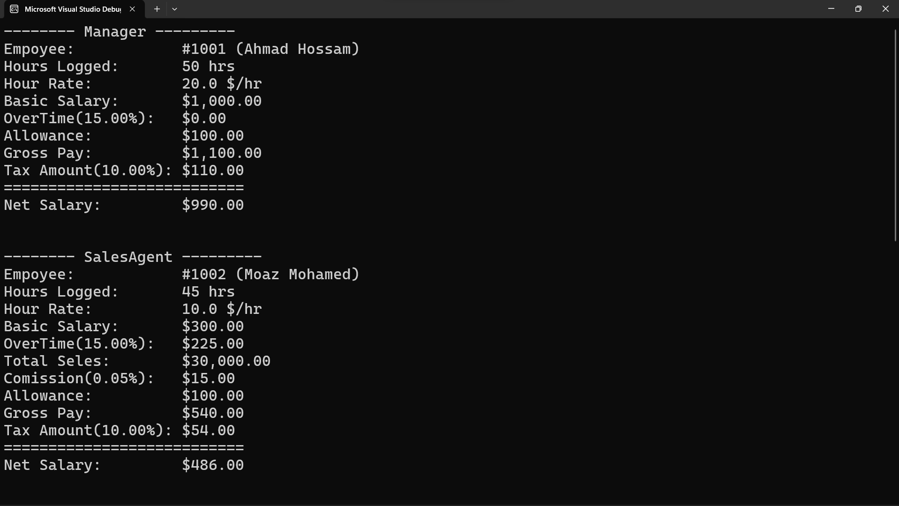
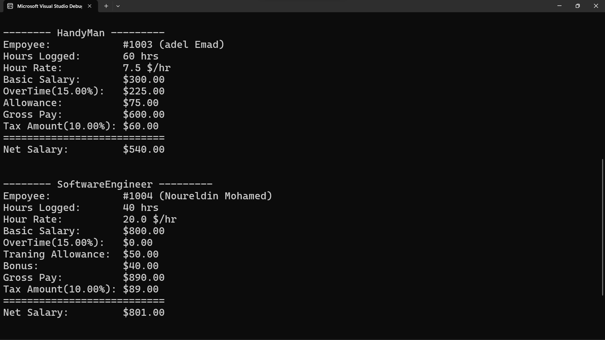

# Salary Calculation System

A C# console application designed to calculate the **net salary** for different employee roles based on their specific attributes and business rules. The system demonstrates core Object-Oriented Programming (OOP) principles such as **inheritance**, **abstraction**, **polymorphism**, and **method overriding**.

---

## Overview

The **Salary Calculation System** supports the following employee roles:
- **Manager**
- **Sales Agent**
- **Handyman**
- **Software Engineer**

Each role has its own salary rules and benefits such as allowances, bonuses, or commissions.

---

##  Technologies Used

- **Language:** C#
- **Platform:** .NET (Console App)
- **Concepts:** OOP (Inheritance, Polymorphism, Abstraction, Overriding)

---

## Salary Calculation Logic

### Common Components:
- **Basic Salary** = HourRate × (LoggedHours - OvertimeHours)
- **Overtime Pay** = OvertimeHours × HourRate × 1.5
- **Tax** = 10% of Gross Pay
- **Net Salary** = Gross Pay - Tax

### Role-Specific Additions:
- **Manager**: + Fixed Allowance
- **Sales Agent**: + Commission based on Total Sales
- **Handyman**: + Hands-on Workship Allowance
- **Software Engineer**: + Training Allowance and conditional Bonus based on Story Points
---
    SalaryCalculationSystem/
    ├── Program.cs              <-> Entry point
    ├── Employee.cs             <-> Abstract base class
    ├── Manager.cs              <-> Manager role
    ├── HandyMan.cs             <-> HandyMan role
    ├── SalesAgent.cs           <-> SalesAgent role
    ├── SoftwareEngineer.cs     <-> SoftwareEngineer role
    └── SystemConstants.cs      <-> Shared configuration and constants

---

## ️ Screenshots
####  At The Running Time


  
*The output 1 ofter runing the system*

  
*The output 2 ofter runing the system*

## How to Run the Project

1. Clone this repository:
   ```bash
   git clone git@github.com:ahmed-hossam-moka/SalaryCalculationSystem.git
2. Run this file name "Program.cs"
